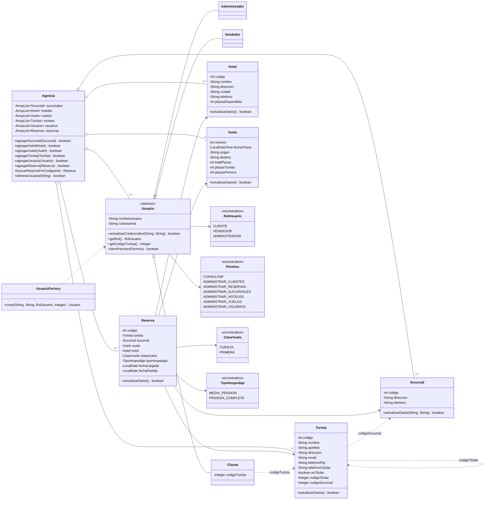

# UML TijeTravel

Este archivo contiene una version previsualizable del UML. Para una version mas detallada y formal, usar `uml-tijetravel.puml`.

## Modelo

```mermaid
classDiagram
    direction LR

    class Agencia {
        -ArrayList~Sucursal~ sucursales
        -ArrayList~Hotel~ hoteles
        -ArrayList~Vuelo~ vuelos
        -ArrayList~Turista~ turistas
        -ArrayList~Usuario~ usuarios
        -ArrayList~Reserva~ reservas
        +agregarSucursal(Sucursal) boolean
        +agregarHotel(Hotel) boolean
        +agregarVuelo(Vuelo) boolean
        +agregarTurista(Turista) boolean
        +agregarUsuario(Usuario) boolean
        +agregarReserva(Reserva) boolean
        +buscarReservaPorCodigo(int) Reserva
        +eliminarUsuario(String) boolean
    }

    class Usuario {
        <<abstract>>
        -String nombreUsuario
        -String contrasenia
        +actualizarCredenciales(String, String) boolean
        +getRol() RolUsuario
        +getCodigoTurista() Integer
        +tienePermiso(Permiso) boolean
    }

    class Administrador
    class Vendedor
    class Cliente {
        -Integer codigoTurista
    }

    class UsuarioFactory {
        +crear(String, String, RolUsuario, Integer) Usuario
    }

    class Turista {
        -int codigo
        -String nombre
        -String apellido
        -String direccion
        -String email
        -String telefonoFijo
        -String telefonoCelular
        -boolean esTitular
        -Integer codigoTitular
        -Integer codigoSucursal
        +actualizarDatos() boolean
    }

    class Sucursal {
        -int codigo
        -String direccion
        -String telefono
        +actualizarDatos(String, String) boolean
    }

    class Hotel {
        -int codigo
        -String nombre
        -String direccion
        -String ciudad
        -String telefono
        -int plazasDisponibles
        +actualizarDatos() boolean
    }

    class Vuelo {
        -int numero
        -LocalDateTime fechaYHora
        -String origen
        -String destino
        -int totalPlazas
        -int plazasTurista
        -int plazasPrimera
        +actualizarDatos() boolean
    }

    class Reserva {
        -int codigo
        -Turista turista
        -Sucursal sucursal
        -Vuelo vuelo
        -Hotel hotel
        -ClaseVuelo claseVuelo
        -TipoHospedaje tipoHospedaje
        -LocalDate fechaLlegada
        -LocalDate fechaPartida
        +actualizarDatos() boolean
    }

    class RolUsuario {
        <<enumeration>>
        CLIENTE
        VENDEDOR
        ADMINISTRADOR
    }

    class Permiso {
        <<enumeration>>
        CONSULTAR
        ADMINISTRAR_CLIENTES
        ADMINISTRAR_RESERVAS
        ADMINISTRAR_SUCURSALES
        ADMINISTRAR_HOTELES
        ADMINISTRAR_VUELOS
        ADMINISTRAR_USUARIOS
    }

    class ClaseVuelo {
        <<enumeration>>
        TURISTA
        PRIMERA
    }

    class TipoHospedaje {
        <<enumeration>>
        MEDIA_PENSION
        PENSION_COMPLETA
    }

    Usuario <|-- Administrador
    Usuario <|-- Vendedor
    Usuario <|-- Cliente

    Agencia o-- "0..*" Sucursal
    Agencia o-- "0..*" Hotel
    Agencia o-- "0..*" Vuelo
    Agencia o-- "0..*" Turista
    Agencia o-- "0..*" Usuario
    Agencia o-- "0..*" Reserva

    Reserva --> Turista
    Reserva --> Sucursal
    Reserva --> Vuelo
    Reserva --> Hotel
    Reserva --> ClaseVuelo
    Reserva --> TipoHospedaje

    Usuario --> RolUsuario
    Usuario --> Permiso
    UsuarioFactory ..> Usuario
    Cliente ..> Turista : codigoTurista
    Turista ..> Sucursal : codigoSucursal
    Turista ..> Turista : codigoTitular
```

## Capas

```mermaid
classDiagram
    direction TB

    class Main

    class VistaPrincipal
    class VistaLogin
    class VistaUsuario {
        <<abstract>>
        #Agencia agencia
        #ControladorDatos controladorDatos
        #ControladorReservas controladorReservas
        #ControladorTuristas controladorTuristas
        #ControladorAdministracion controladorAdministracion
        #ControladorUsuarios controladorUsuarios
        +mostrar(Usuario) void
    }
    class VistaCliente
    class VistaVendedor
    class VistaAdministrador

    class ControladorDatos {
        +cargarTodo() Agencia
        +guardarTodo(Agencia) void
    }
    class ControladorLogin {
        +iniciarSesion(String, String) Usuario
    }
    class ControladorAutorizacion {
        +tienePermiso(Usuario, Permiso) boolean
    }
    class ControladorAdministracion
    class ControladorTuristas
    class ControladorReservas
    class ControladorUsuarios

    class Archivo {
        <<interface>>
        +cargar() ArrayList~T~
        +guardar(List~T~) void
    }
    class ArchivoTexto {
        <<abstract>>
        #guardarAtomico(Path, EscrituraArchivo) void
        #errorCarga(Path, Exception) PersistenciaException
    }
    class EscrituraArchivo {
        <<interface>>
        +escribir(BufferedWriter) void
    }
    class PersistenciaException
    class ArchivoSucursales
    class ArchivoHoteles
    class ArchivoVuelos
    class ArchivoTuristas
    class ArchivoUsuarios
    class ArchivoReservas

    class Agencia
    class Usuario
    class Sucursal
    class Hotel
    class Vuelo
    class Turista
    class Reserva
    class Permiso
    class RolUsuario
    class ClaseVuelo
    class TipoHospedaje

    Main ..> ControladorDatos
    Main ..> VistaPrincipal

    VistaUsuario <|-- VistaCliente
    VistaUsuario <|-- VistaVendedor
    VistaUsuario <|-- VistaAdministrador
    VistaPrincipal ..> VistaLogin
    VistaPrincipal ..> VistaCliente
    VistaPrincipal ..> VistaVendedor
    VistaPrincipal ..> VistaAdministrador

    VistaPrincipal --> Agencia
    VistaPrincipal --> ControladorDatos
    VistaLogin --> ControladorLogin
    VistaUsuario --> ControladorDatos
    VistaUsuario --> ControladorReservas
    VistaUsuario --> ControladorTuristas
    VistaUsuario --> ControladorAdministracion
    VistaUsuario --> ControladorUsuarios

    ControladorLogin --> Agencia
    ControladorAutorizacion ..> Usuario
    ControladorAutorizacion ..> Permiso
    ControladorAdministracion --> Agencia
    ControladorAdministracion --> ControladorAutorizacion
    ControladorAdministracion --> ControladorReservas
    ControladorTuristas --> Agencia
    ControladorTuristas --> ControladorAutorizacion
    ControladorReservas --> Agencia
    ControladorReservas --> ControladorAutorizacion
    ControladorUsuarios --> Agencia
    ControladorUsuarios --> ControladorAutorizacion
    ControladorDatos --> Agencia

    ControladorDatos *-- ArchivoSucursales
    ControladorDatos *-- ArchivoHoteles
    ControladorDatos *-- ArchivoVuelos
    ControladorDatos *-- ArchivoTuristas
    ControladorDatos *-- ArchivoUsuarios
    ControladorDatos *-- ArchivoReservas

    ArchivoTexto <|-- ArchivoSucursales
    ArchivoTexto <|-- ArchivoHoteles
    ArchivoTexto <|-- ArchivoVuelos
    ArchivoTexto <|-- ArchivoTuristas
    ArchivoTexto <|-- ArchivoUsuarios
    ArchivoTexto <|-- ArchivoReservas

    Archivo <|.. ArchivoSucursales
    Archivo <|.. ArchivoHoteles
    Archivo <|.. ArchivoVuelos
    Archivo <|.. ArchivoTuristas
    Archivo <|.. ArchivoUsuarios

    ArchivoTexto ..> EscrituraArchivo
    ArchivoTexto ..> PersistenciaException
    ArchivoReservas ..> Agencia
    ArchivoReservas ..> Reserva
```
