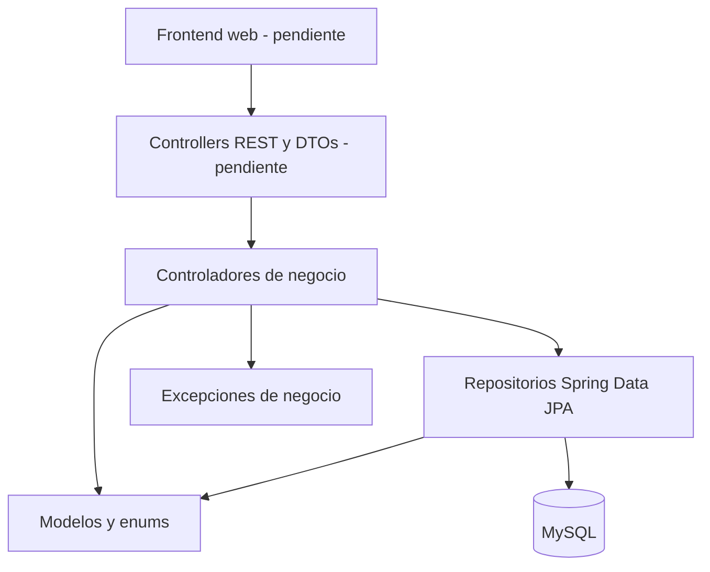
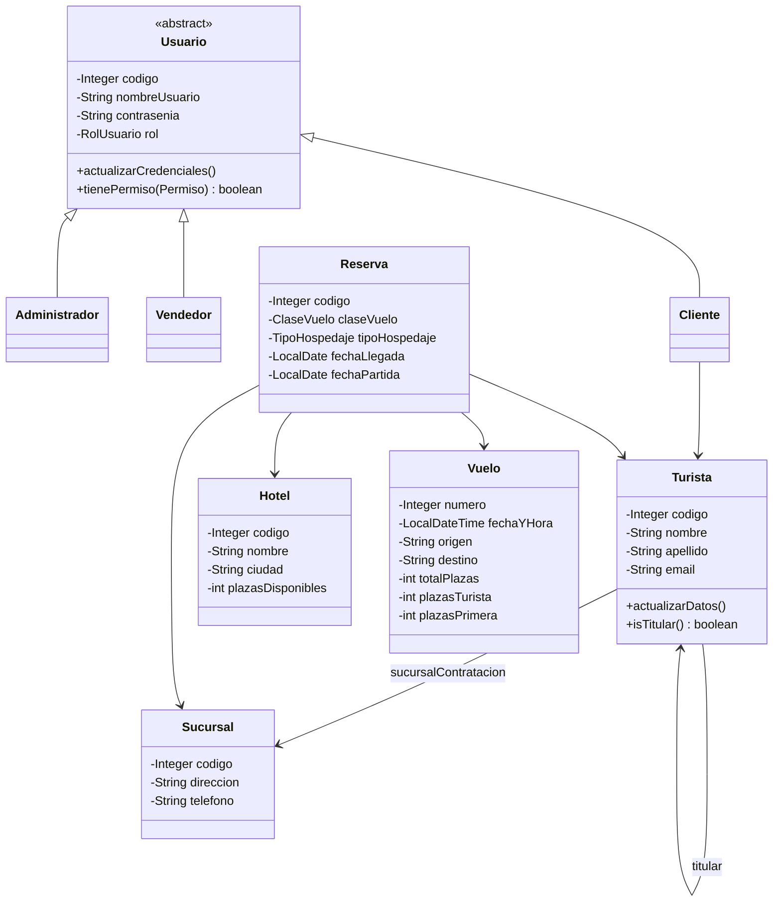
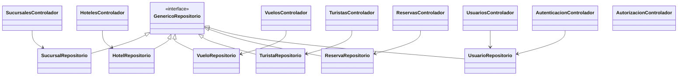

# UML Tije Travel

Este diagrama representa el nucleo de la version web. La version PlantUML se
encuentra en `uml-tijetravel.puml`.

Las exportaciones `uml.svg` y `uml.pdf` corresponden al UML de la primera
entrega y se conservan como referencia historica.

## Capas

## Dominio

## Componentes

